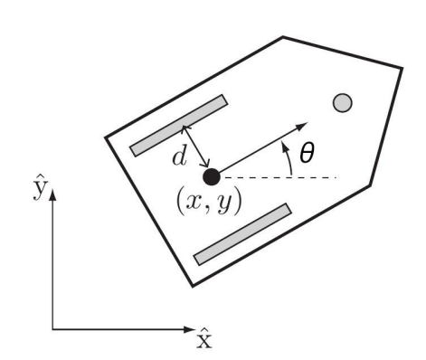
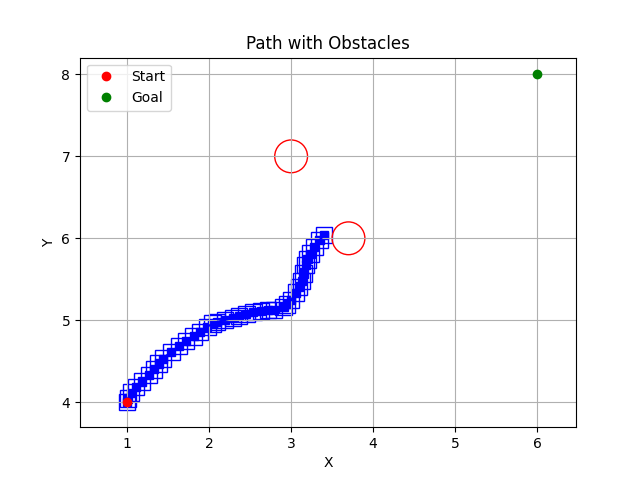
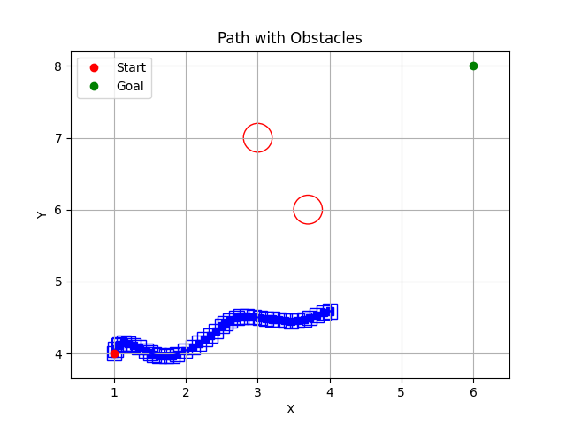

# Exercise 1 — Differential-Drive Modeling and Kinodynamic RRT

This repository contains my solution for **Exercise 1**, which follows the questions from the assignment PDF: (1) differential-drive kinematic modeling, (2) numerical integration (Euler and RK4), and (3) kinodynamic motion planning using a Rapidly-exploring Random Tree (RRT), including an obstacles case.

---

## Robot model (reference)



---

## Repository structure

- **`main.py`**  
  The only entry point I run. It only calls run-functions defined in the other files.

- **`Modeling.py`**  
  Implements the differential-drive kinematics and simulation utilities:
  - `diff_kinematics(x, u)`
  - Euler integration helpers
  - RK4 integrator step: `f_rk4_one_step(x0, u0)`
  - Visualization: `visualize_transitions_with_euler(...)`, `visualize_transitions_with_rk4(...)`

- **`Rapidly_exploring_Random_Trees.py`**  
  Implements a **kinodynamic RRT** using the RK4 integrator from `Modeling.py`. The planner:
  - samples target states in SE(2),
  - selects the nearest existing tree node,
  - tries to connect by simulating short motion segments produced from sampled control sequences,
  - rejects trajectories that collide with obstacles,
  - returns a reconstructed path from the tree.

- **`Differential_Drive_Robot_Path_Following.py`**  
  Runs the planner and plots the resulting path (with and without obstacles).

---

## Algorithm structure (brief)

The kinodynamic RRT portion is implemented as:
1. **Sample** a target state (with a small goal bias).
2. **Nearest**: pick the closest node already in the tree.
3. **Connect**: sample candidate wheel-speed sequences, simulate forward using RK4, keep the best valid rollout toward the target.
4. **Extend** the tree with the selected new state and its edge.
5. **Stop** when the goal tolerance is satisfied, otherwise continue until the iteration limit.

---

## Initial values used

### Path planning (with obstacles)
- **Start state**:  
  - orientation: θ = π/2  
  - position: x = 1, y = 4

- **Goal state**:  
  - orientation: θ = −π/2    
  - position: x = 6, y = 8

- **Obstacles** (circles, format: radius, x, y):  
  - (0.2, 3, 7) 
  - (0.2, 3.7, 6)

- **Planner settings**:  
  - maximum iterations: **300**  
  - control samples per expansion (connect attempts): **200**

### Modeling demo (RK4)
- **Input (wheel speeds)**: u = [0.42, 0.43]^T   
- **Initial state**:  
  - orientation: θ = π/12  
  - position: x = 1, y = 7
- **Simulation length**: **200** RK4 steps

---

## How to run

Install requirements:
- `numpy`
- `matplotlib`

Run:
```bash
python main.py
```

---

## Results

Example outputs for the obstacle scenario using the initial values above:




